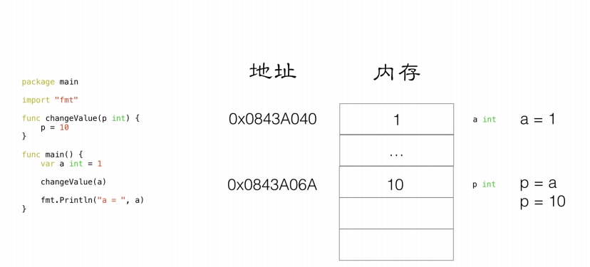
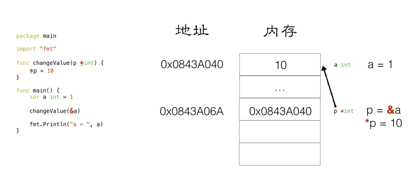
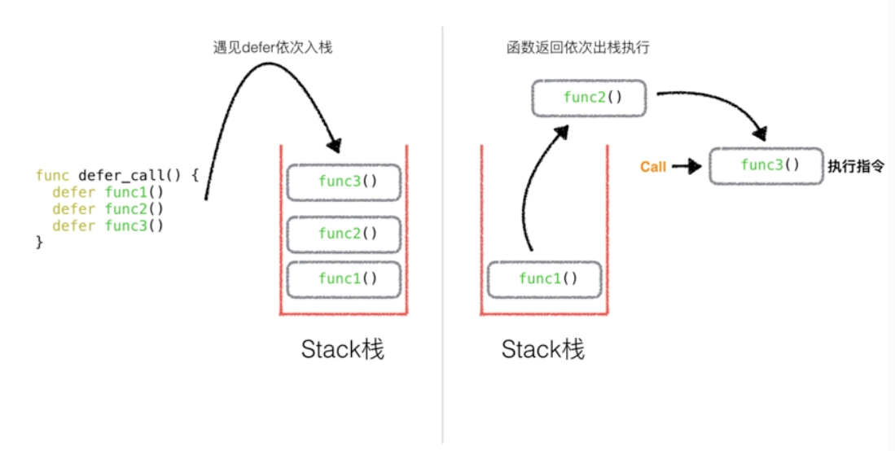
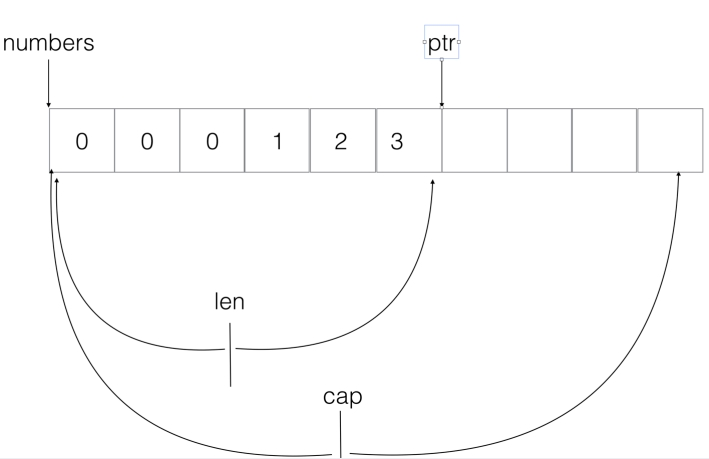

## 0x00. 第一个Go程序
```Golang
package main//程序包名

import "fmt" //单个包导入方式

//多个包导入方式
import (
    "fmt"
    "time"
)

func main(){ //Go要求函数左括号必须在和func在同一行
    //Go表达式推荐不加";"结尾，但加不加都可以
    fmt.println("hello,world!")
}
```
## 0x01. 变量声明
在Go中，声明一个变量有四种方式，首先是声明一个默认值为0的变量，然后在声明的同时，我们可以为变量赋值来初始化这个变量，在初始化时可以省去数据类型，通过值自动匹配当前变量的数据类型。最后也是最常用的方法是省去var关键字，直接用":="赋值自动匹配。  
多变量声明方式分为单行写法和多行写法。  
在声明全局变量时，方法1，2，3都是可以的，但是不能用:=直接赋值。
```Golang
//方法1：声明一个变量
var a int

//方法2：声明变量时初始化
var b int = 100

//方法3：在初始化时省去数据类型，通过值自动匹配当前的数据类型
var c = 100

//方法4：常用方法，直接自动匹配
d := 100

//多变量声明方式-单行写法
var x,y int = 100,200

//多变量声明方式-多行写法
var (
		m  int     = 100
		n  float32 = 0.01
	)

//全局变量声明，即在main外声明，方法1，2，3均可，方法4报错
var gA int = 100
```
## 0x02. 常量声明
在Go中，常量声明需要关键字const，常量一经声明不得修改。  
常量可以用来定义枚举类型，同时有一个iota特性。iota只能配合const一起使用，iota在const中有累加效果。
```Golang
//常量(只读属性)
const length int = 10

const (
    a = 10
    b = 20
)

//const 来定义枚举类型
const (
	//可以在const() 添加一个关键字 iota， 每行的iota都会累加1, 第一行的iota的默认值是0
	BEIJING = 10*iota	 //iota = 0
	SHANGHAI 		  //iota = 1
	SHENZHEN          //iota = 2
)

const (
	a, b = iota+1, iota+2 // iota = 0, a = iota + 1, b = iota + 2, a = 1, b = 2
	c, d				  // iota = 1, c = iota + 1, d = iota + 2, c = 2, d = 3
	e, f				  // iota = 2, e = iota + 1, f = iota + 2, e = 3, f = 4

	g, h = iota * 2, iota *3  // iota = 3, g = iota * 2, h = iota * 3, g = 6, h = 9 
	i, k					   // iota = 4, i = iota * 2, k = iota * 3 , i = 8, k = 12
)
```
## 0x03. 函数
定义函数关键字func，函数定义一般语法为：func 函数名（形参名称 形参类型）返回值名称，返回值类型。Go支持函数多返回值，第一种是返回多个匿名返回值，第二种是返回带有形参名称的返回值。如果返回值类型相同，则可以简写。
```Golang
func func1(a string, b int) int {
	fmt.Println(a)
	fmt.Println(b)
	c := 100
	return c
}
//返回多个匿名返回值
func func2(a int, b int) (int, int) {
	fmt.Println(a)
	fmt.Println(b)
	return b, a + b
}
// 返回多个有形参名称的返回值
func func3(a int, b int) (result1 int, result2 int) {
	result1 = a + b
	result2 = a - b
	return result1,result2
}
func func4(a int, b int) (result1 int, result2 int) {
	fmt.Println(a)
	fmt.Println(b)
	//给有名称的返回值变量赋值
	result2 = 2000
	result1 = 1000
	return
}
//若返回值类型相同，则可以进行简写
func func5(a int, b int) (result1, result2 int) {
	fmt.Println(a)
	fmt.Println(b)
	//给有名称的返回值变量赋值
	result2 = 3000
	result1 = 5000
	return
}
```
## 0x04. init()函数
init为函数初始化，在每次import包后自动执行的初始化函数，在main函数前做准备工作，具体执行过程如下图所示。


注意import的包一定要在$GOPATH/src目录下，其中测试文件1和测试文件2的代码和路径如下：  
```Golang
//$GOPATH/src/testlib/lib1/lib1.go
package lib1
import "fmt"
func Lib1test() {
	fmt.Println("lib1test is running!")
}
func init() {
	fmt.Println("lib1 init")
}
//$GOPATH/src/testlib/lib2/lib2.go
package lib2
import "fmt"
func Lib2test() {
	fmt.Println("lib1test running!")
}
func init() {
	fmt.Println("lib2 init")
}
```
测试函数：  
```Golang
package main

import (
	"testlib/lib1"
	"testlib/lib2"
)

func main() {
	lib1.Lib1test()
	lib2.Lib2test()
}
```
返回结果：
```bash
lib1 init
lib2 init
lib1test is running!
lib2test is running!
```
## 0x05. import导包
在Go中，通过import导入package有三种方法：  
1. 匿名导入：无法使用当前包的方法，但是会执行内部的init方法；
2. 给当前包起一个别名，利用别名来调用方法；
3. 导入全部方法，直接调用API即可。  

下面代码分别展示三种import方法：
```Golang
//匿名导入
//给fmt包起一个别名，匿名，无法使用当前包方法，但会调用内部init()
import _ "fmt"

//别名导入
//给fmt包起一个别名，aa，aa可直接调用fmt方法，aa.Println()
import aa "fmt"

//全部导入
//将fmt的全部方法导入当前包的作用中，fmt的全部方法可以直接调用API而不需要fmt.API调用
import . "fmt"
```
## 0x06. 指针
Go中的指针与C++类似，指针存一个变量的地址，如果对变量本身进行修改，则在函数中进行指针传递。


```Golang
func swap(pa *int, pb *int) {
	var temp int
	temp = *pa //temp = main::a
	*pa = *pb  // main::a = main::b
	*pb = temp // main::b = temp
}
func main() {
	var a int = 10
	var b int = 20

	swap(&a, &b)

	fmt.Println("a = ", a, " b = ", b)
	//a =  20  b =  10

	fmt.Println(&a) //0xc000096068
}
```
## 0x07. defer
Go中的defer用于在退出当前函数前执行某些特定逻辑，比如close或unlock等操作。涉及到两个关键点，首先是defer的执行顺序，defer调用时利用栈来存储，所以是后进先出，执行顺序为func3->func2->func1；

```Golang
func main() {
	//写入defer关键字
	defer fmt.Println("main end1")
	defer fmt.Println("main end2")
	
	fmt.Println("main::hello go 1")
	fmt.Println("main::hello go 2")
}
//main::hello go 1
//main::hello go 2
//main end2
//main end1
```
第二个关键点是defer和return的执行顺序：return语句先执行，defer语句后执行。
```Golang
func deferTest() int {
	fmt.Println("defer called...")
	return 0
}
func returnTest() int {
	fmt.Println("return called...")
	return 0
}
func returnandDeferTest() int {
	defer deferTest()
	return returnTest()
}
func main() {
	returnandDeferTest()
}
//return called...
//defer called...
```
## 0x08. 数组
数组是切片slice和映射map的基础数据结构。数组是一个长度固定的数据类型，用于存储一段具有相同类型元素的连续块，一旦声明，数组中存储的数据类型和数组长度就都不能再改变。在数组初始化时，如果没有指定数组元素，则默认为0。数组传递在函数中为值拷贝，无法在函数中对数组值进行修改。
```Golang
//定义数组的方式，没有初始化则元素默认为0
var myArray1 [10]int
myArray2 := [10]int{1, 2, 3, 4}
//遍历数组的方式
for i := 0; i < len(myArray1); i++ {
		fmt.Println(myArray1[i])
	}
for index, value := range myArray2 {
		fmt.Println("index = ", index, ", value = ", value)
	}
func printArray1(myArray [4]int) {
	//值拷贝
	for index, value := range myArray {
		fmt.Println("index = ", index, ", value = ", value)
	}

	myArray[0] = 111 //无法修改
}
```
## 0x09. 切片（动态数组）
切片和数组在声明时的区别在于，切片在[ ]运算符中为空，如果在[ ]运算符中指定了一个值，那么创建的就是一个数组而不是切片。只有不指定值时，才会创建切片。  
切片和数组的第一个区别是，在函数中，切片是引用传递，数组是值传递：
```Golang
func printArray(myArray []int) {
	//引用传递
	// _ 表示匿名的变量
	for _, value := range myArray {
		fmt.Println("value = ", value)
	}
	myArray[0] = 100
}
func main() {
	myArray := []int{1, 2, 3, 4} // 动态数组，切片 slice
	fmt.Printf("myArray type is %T\n", myArray)

	printArray(myArray)

	fmt.Println(" ==== ")
	for _, value := range myArray {
		fmt.Println("value = ", value)
	}
}
//改变value为100
```
切片的声明方式与初始化：
```Golang
//声明slice1是一个切片，并且初始化，默认值是1，2，3  长度len是3
slice1 := []int{1, 2, 3}

//声明slice2是一个切片，但是并没有给slice分配空间
slice2 := []int

//为slice2开辟3个空间，默认值是0
slice2 = make([]int,3)

//声明slice3是一个切片，同时给slice3分配3个空间，初始化值是0
var slice3 []int = make([]int, 3)

//声明slice4是一个切片，同时给slice4分配3个空间，初始化值是0, 通过:=推导出slice是一个切片
slice4 := make([]int,3)

//判断一个silce是否为0
	if slice1 == nil {
		fmt.Println("slice1 是一个空切片")
	} else {
		fmt.Println("slice1 是有空间的")
	}
```
切片容量的增加，slice分为len长度和cap容量，当append追加的元素数量超过了cap容量时，cap会翻倍扩充，这是切片的扩容机制。切⽚的⻓度和容量不同，⻓度表示左指针至右指针之间的距离，容量表示左指针⾄底层数组末尾的距离。

```Golang
var numbers = make([]int, 3, 5)
numbers = append(numbers, 1)
//向numbers切片追加一个元素2, numbers len = 5， [0,0,0,1,2], cap = 5
numbers = append(numbers, 2)
//向一个容量cap已经满的slice 追加元素
numbers = append(numbers, 3)
//此时len = 6, cap = 10, slice = [0 0 0 1 2 3]


//切片操作
s := []int{1, 2, 3}  //len = 3, cap = 3, [1,2,3]
//切片的截取
s1 := s[0:2]  //[0, 2)
fmt.Println(s1)  // [1, 2]
//此处修改s1的值，则会修改底层s中的值
s1[0] = 100 
fmt.Println(s) // [100,2,3]
fmt.Println(s1)  //[100,2]
//copy 可以将底层数组的slice一起进行拷贝
s2 := make([]int, 3) //s2 = [0,0,0]
//将s中的值 依次拷贝到s2中
copy(s2, s)
fmt.Println(s2) // s2 = [100 2 3]
```
## 0x10. 映射
映射Map，就像python中的字典结构一样，是key-value格式保存的，有三种声明方式。
```Golang
//方法1：声明myMap1是一种map类型，key是string， value是string
var myMap1 map[string]string
if myMap1 == nil {
	fmt.Println("myMap1 是一个空map")
}
//在使用map前， 需要先用make给map分配数据空间
myMap1 = make(map[string]string, 10)
myMap1["one"] = "java"
myMap1["two"] = "c++"
myMap1["three"] = "python"
fmt.Println(myMap1)

//方法2：
myMap2 := make(map[int]string)
myMap2[1] = "java"
myMap2[2] = "c++"
myMap2[3] = "python"

//方法3：
myMap3 := map[string]string{
		"one":   "php",
		"two":   "c++",
		"three": "python",
	}
```
对map可以正常进行增删改查等操作，map是引用传递，在函数中修改内容会影响源数据。
```Golang
func printMap(cityMap map[string]string) {
	//cityMap 是一个引用传递
	for key, value := range cityMap {
		fmt.Println("key = ", key)
		fmt.Println("value = ", value)
	}
}

func ChangeValue(cityMap map[string]string) {
	cityMap["England"] = "London"
}
func main() {
	cityMap := make(map[string]string)

	//添加
	cityMap["China"] = "Beijing"
	cityMap["Japan"] = "Tokyo"
	cityMap["USA"] = "NewYork"

	//删除
	delete(cityMap, "China")

	//修改
	cityMap["USA"] = "DC"
	ChangeValue(cityMap)

	//遍历
	printMap(cityMap)
}
```