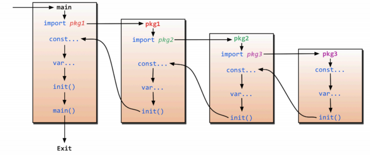

## 0x00. 第一个Go程序
```Golang
package main//程序包名

import "fmt" //单个包导入方式

//多个包导入方式
import (
    "fmt"
    "time"
)

func main(){ //Go要求函数左括号必须在和func在同一行
    //Go表达式推荐不加";"结尾，但加不加都可以
    fmt.println("hello,world!")
}
```
## 0x01. 变量声明
在Go中，声明一个变量有四种方式，首先是声明一个默认值为0的变量，然后在声明的同时，我们可以为变量赋值来初始化这个变量，在初始化时可以省去数据类型，通过值自动匹配当前变量的数据类型。最后也是最常用的方法是省去var关键字，直接用":="赋值自动匹配。  
多变量声明方式分为单行写法和多行写法。  
在声明全局变量时，方法1，2，3都是可以的，但是不能用:=直接赋值。
```Golang
//方法1：声明一个变量
var a int

//方法2：声明变量时初始化
var b int = 100

//方法3：在初始化时省去数据类型，通过值自动匹配当前的数据类型
var c = 100

//方法4：常用方法，直接自动匹配
d := 100

//多变量声明方式-单行写法
var x,y int = 100,200

//多变量声明方式-多行写法
var (
		m  int     = 100
		n  float32 = 0.01
	)

//全局变量声明，即在main外声明，方法1，2，3均可，方法4报错
var gA int = 100
```
## 0x02. 常量声明
在Go中，常量声明需要关键字const，常量一经声明不得修改。  
常量可以用来定义枚举类型，同时有一个iota特性。iota只能配合const一起使用，iota在const中有累加效果。
```Golang
//常量(只读属性)
const length int = 10

const (
    a = 10
    b = 20
)

//const 来定义枚举类型
const (
	//可以在const() 添加一个关键字 iota， 每行的iota都会累加1, 第一行的iota的默认值是0
	BEIJING = 10*iota	 //iota = 0
	SHANGHAI 		  //iota = 1
	SHENZHEN          //iota = 2
)

const (
	a, b = iota+1, iota+2 // iota = 0, a = iota + 1, b = iota + 2, a = 1, b = 2
	c, d				  // iota = 1, c = iota + 1, d = iota + 2, c = 2, d = 3
	e, f				  // iota = 2, e = iota + 1, f = iota + 2, e = 3, f = 4

	g, h = iota * 2, iota *3  // iota = 3, g = iota * 2, h = iota * 3, g = 6, h = 9 
	i, k					   // iota = 4, i = iota * 2, k = iota * 3 , i = 8, k = 12
)
```
## 0x03. 函数
定义函数关键字func，函数定义一般语法为：func 函数名（形参名称 形参类型）返回值名称，返回值类型。Go支持函数多返回值，第一种是返回多个匿名返回值，第二种是返回带有形参名称的返回值。如果返回值类型相同，则可以简写。
```Golang
func func1(a string, b int) int {
	fmt.Println(a)
	fmt.Println(b)
	c := 100
	return c
}
//返回多个匿名返回值
func func2(a int, b int) (int, int) {
	fmt.Println(a)
	fmt.Println(b)
	return b, a + b
}
// 返回多个有形参名称的返回值
func func3(a int, b int) (result1 int, result2 int) {
	result1 = a + b
	result2 = a - b
	return result1,result2
}
func func4(a int, b int) (result1 int, result2 int) {
	fmt.Println(a)
	fmt.Println(b)
	//给有名称的返回值变量赋值
	result2 = 2000
	result1 = 1000
	return
}
//若返回值类型相同，则可以进行简写
func func5(a int, b int) (result1, result2 int) {
	fmt.Println(a)
	fmt.Println(b)
	//给有名称的返回值变量赋值
	result2 = 3000
	result1 = 5000
	return
}
```
## 0x04. init()函数
init为函数初始化，在每次import包后自动执行的初始化函数，在main函数前做准备工作，具体执行过程如下图所示。


注意import的包一定要在$GOPATH/src目录下，其中测试文件1和测试文件2的代码和路径如下：  
```Golang
//$GOPATH/src/testlib/lib1/lib1.go
package lib1
import "fmt"
func Lib1test() {
	fmt.Println("lib1test is running!")
}
func init() {
	fmt.Println("lib1 init")
}
//$GOPATH/src/testlib/lib2/lib2.go
package lib2
import "fmt"
func Lib2test() {
	fmt.Println("lib1test running!")
}
func init() {
	fmt.Println("lib2 init")
}
```
测试函数：  
```Golang
package main

import (
	"testlib/lib1"
	"testlib/lib2"
)

func main() {
	lib1.Lib1test()
	lib2.Lib2test()
}
```
返回结果：
```bash
lib1 init
lib2 init
lib1test is running!
lib2test is running!
```
## 0x05. import导包
在Go中，通过import导入package有三种方法：  
1. 匿名导入：无法使用当前包的方法，但是会执行内部的init方法；
2. 给当前包起一个别名，利用别名来调用方法；
3. 导入全部方法，直接调用API即可。  

下面代码分别展示三种import方法：
```Golang
//匿名导入
//给fmt包起一个别名，匿名，无法使用当前包方法，但会调用内部init()
import _ "fmt"

//别名导入
//给fmt包起一个别名，aa，aa可直接调用fmt方法，aa.Println()
import aa "fmt"

//全部导入
//将fmt的全部方法导入当前包的作用中，fmt的全部方法可以直接调用API而不需要fmt.API调用
import . "fmt"
```
## 0x06. 指针

## 0x07. defer

